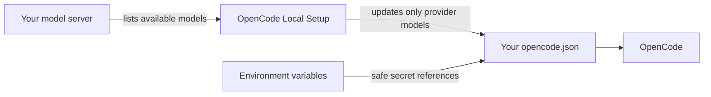

<div align="center">
  

  <br />

  [](https://github.com/groxaxo/opencode-local-setup/actions/workflows/ci.yml)
  [](https://opencode.ai/config.json)
  [](https://nodejs.org/)
  [](LICENSE)

  ### Full automated setup — from environment to running models in OpenCode.

  Detects your OS, installs prerequisites (Node.js, Ollama), downloads models, configures everything, and launches OpenCode.

  **One command. Zero manual configuration.**

  [Get started](#get-started) · [What's new](#whats-new-full-automated-setup) · [See how it works](#what-happens-behind-the-scenes) · [Troubleshooting](docs/troubleshooting.md)
</div>

---

## What problem does this solve?

OpenCode works beautifully with built-in providers. Local models are a little messier.

You load a different model in LM Studio. You restart Ollama. You move vLLM to another machine. The model name changes, but your OpenCode configuration does not.

**OpenCode Local Setup keeps the two in sync.**

When you open OpenCode, it checks the model servers you configured, discovers what is actually available, and updates only the relevant part of your `opencode.json`.

```text
Your model server  →  discovers live models  →  OpenCode is ready
```

It leaves the rest of your OpenCode setup alone.

## Get started

### Quick start — fully automated (recommended)

**One command handles everything**: environment detection, prerequisite installation, model downloading, configuration, and launch.

```bash
# Unix/macOS/Linux
git clone https://github.com/groxaxo/opencode-local-setup.git && cd opencode-local-setup
pnpm run setup:ollama         # Auto-installs Ollama + downloads models

# Windows (PowerShell)
.\scripts\install.ps1         # Full auto-setup with LM Studio
```

### Manual install (legacy)

If you prefer to manage your model server separately:

#### 1. Install OpenCode

```bash
curl -fsSL https://opencode.ai/install | bash
```

#### 2. Install this helper

```bash
git clone https://github.com/groxaxo/opencode-local-setup.git
cd opencode-local-setup
./scripts/install.sh          # Unix/macOS/Linux
.\scripts\install.ps1         # Windows (PowerShell)
```

#### 3. Start your model server and open OpenCode

```bash
opencode
```

That is it. The default setup looks for LM Studio at:

```text
http://127.0.0.1:1234/v1
```

Inside OpenCode, use `/models` to choose a model.

## What's new — full automated setup

The installer now handles the entire chain automatically:

| Step | What happens |
|---|---|
| **Environment detection** | Detects OS (Windows/macOS/Linux distro), Node.js version, available RAM |
| **Prerequisite install** | Installs Node.js 18+ if missing (via Homebrew, APT, DNF, pacman, or MSI) |
| **OpenCode install** | Auto-installs OpenCode via official installer if not present |
| **Model server setup** | Installs Ollama on Unix (`--install-ollama`), LM Studio on Windows |
| **Model download** | Downloads recommended models based on your RAM (4/8/16/32 GB tiers) |
| **Configuration** | Generates `opencode.json`, `.env.local`, shell wrappers — all automated |

### Setup commands

```bash
# Full auto-setup with defaults
pnpm run setup

# Specify provider and models
node scripts/full-setup.mjs --provider ollama --models phi-3-mini,llama-3.1-8b

# Skip model download (server already has them)
node scripts/full-setup.mjs --skip-models

# Install server if missing
node scripts/full-setup.mjs --install-server

# Check environment status
pnpm run env-report
```

### Windows-specific options

```powershell
.\scripts\install.ps1 -Provider ollama          # Use Ollama instead of LM Studio
.\scripts\install.ps1 -InstallVLLM              # Also install vLLM (requires Python)
.\scripts\install.ps1 -Models phi-3-mini        # Specific models only
.\scripts\install.ps1 -SkipLMStudio             # Skip LM Studio installation
```

### Unix-specific options

```bash
./scripts/install.sh --install-ollama           # Auto-install Ollama + models
./scripts/install.sh --provider ollama          # Use Ollama as primary
./scripts/install.sh --models phi-3-mini        # Specific models only
./scripts/install.sh --skip-models              # Skip model download
```

### Model catalog

The built-in `models.json` includes 10+ popular models with per-provider identifiers:

| Model | RAM needed | Ollama tag | vLLM repo |
|---|---|---|---|
| Phi-3 Mini (3.8B) | 4 GB | `phi3:mini` | `microsoft/Phi-3-mini-4k-instruct` |
| Qwen2.5 Coder (7B) | 8 GB | `qwen2.5-coder:7b` | `Qwen/Qwen2.5-Coder-7B-Instruct` |
| Llama 3.1 (8B) | 8 GB | `llama3.1:8b` | `meta-llama/Meta-Llama-3.1-8B-Instruct` |
| Gemma 2 (9B) | 8 GB | `gemma2:9b` | `google/gemma-2-9b-it` |

Models are auto-selected based on your available system RAM. Override with `--models`.

## Pick the setup you use

| You run | Start with | Helper command |
|---|---|---|
| **LM Studio** | `http://127.0.0.1:1234/v1` | `oc-lmstudio` |
| **Ollama** | `http://127.0.0.1:11434/v1` | `oc-ollama` |
| **vLLM** | `http://127.0.0.1:8000/v1` | `oc-vllm` |
| **llama.cpp** | `http://127.0.0.1:8080/v1` | `oc-llamacpp` |
| **Remote GPU server** | Any reachable OpenAI-compatible URL | Add it to `opencode.json` |

The helper commands synchronize that server and launch OpenCode:

```bash
oc-ollama
oc-vllm
oc-lmstudio "Review this repository"
```

They are prefixed with `oc-`, so they never replace the real `ollama`, `vllm`, or server commands on your computer.

## What you get

### Your model list stays fresh

Load or remove a model on the server and OpenCode sees the change on the next sync.

### Your existing configuration is respected

The synchronizer updates provider models without replacing unrelated settings, agents, MCP servers, permissions, themes, or keybindings.

### Secrets stay out of the file

API keys remain in environment variables or OpenCode's own credential store. Generated provider entries use safe references such as:

```json
"apiKey": "{env:REMOTE_API_KEY}"
```

### Local and remote machines work the same way

A model can run on your laptop, desktop, home server, LAN workstation, or trusted Tailscale machine. If the endpoint is reachable and OpenAI-compatible, it can be synchronized.

### It is designed to fail quietly

A sleeping GPU box or closed LM Studio window should not stop OpenCode from opening. Launch checks use short timeouts and skip unavailable endpoints.

## What happens behind the scenes?



In plain English:

1. It reads the OpenCode configuration you already use.
2. It accepts normal JSON or JSONC with comments and trailing commas.
3. It asks each configured server for its live model list.
4. It refreshes model names and supported metadata.
5. It removes models that are no longer served, unless configured otherwise.
6. It writes the file safely and keeps it private to your user account.

## Commands you will actually use

### Setup commands (new)

```bash
pnpm run setup                   # Full automated setup
node scripts/full-setup.mjs --provider ollama  # Specify provider
node scripts/download-models.mjs ollama phi-3-mini  # Download specific model
node scripts/setup-env.mjs       # Environment report
```

### Runtime commands

```bash
opencode                         # Open OpenCode with a quick pre-launch sync
sync-models                      # Refresh your configured compatible servers
download-models <provider> [models...]  # Download models from catalog
env-report                       # Show environment status
full-setup [options]             # Re-run full setup
opencode models                  # Show available provider/model IDs
opencode models --refresh        # Refresh OpenCode's built-in provider cache
opencode auth login              # Connect a built-in cloud provider
oc-doctor                        # Check config health and secret hygiene
opencode upgrade                 # Upgrade OpenCode
```

### Windows PowerShell commands

```powershell
oc-lmstudio                      # Sync LM Studio and launch OpenCode
download-models lmstudio phi-3-mini  # Download models for LM Studio
env-report                       # Environment report
```

## Change the default server

Edit the small environment file created by the installer:

```bash
$EDITOR ~/.config/opencode/local-setup/.env.local
```

For example:

```bash
LOCAL_API_BASE=http://127.0.0.1:11434/v1
OPENCODE_PROVIDER_ID=ollama
OPENCODE_PROVIDER_NAME="Ollama"
```

Then run:

```bash
sync-models
```

## Connect a remote GPU machine

Add a provider to `~/.config/opencode/opencode.json`:

```json
{
  "$schema": "https://opencode.ai/config.json",
  "provider": {
    "gpu-box": {
      "npm": "@ai-sdk/openai-compatible",
      "name": "My GPU Box",
      "options": {
        "baseURL": "http://100.100.100.100:8000/v1",
        "apiKey": "{env:REMOTE_API_KEY}"
      },
      "models": {}
    }
  }
}
```

Export the key only when the server requires one:

```bash
export REMOTE_API_KEY="your-key"
sync-models
```

Tailscale discovery is available for trusted networks, but remains off by default. Explicit providers work without any scanning.

<details>
<summary><strong>Enable narrowly scoped Tailscale discovery</strong></summary>

```bash
export OPENCODE_TAILSCALE_DISCOVERY=1
export OPENCODE_TAILSCALE_PORTS=1234,8000,8080,11434
sync-models
```

Only online peers and the ports you list are checked.

</details>

## Safe by default

- Raw API keys are not written into generated configuration.
- Existing OpenCode settings are preserved.
- Config updates are atomic, reducing the chance of a half-written file.
- File permissions are restricted to your user.
- Tailscale discovery is opt-in.
- Post-exit synchronization is opt-in.
- Automatic session sharing is not enabled.

Run the built-in health check whenever something feels wrong:

```bash
oc-doctor
```

## Already installed an older version?

```bash
# Unix/macOS/Linux
cd opencode-local-setup
git pull
./scripts/install.sh
oc-doctor

# Windows (PowerShell)
cd opencode-local-setup
.\scripts\install.ps1
oc-doctor
```

Your existing `opencode.json` and local environment file are preserved.

## Built for people who

- Run private or local models while coding.
- Swap models frequently in LM Studio or Ollama.
- Serve models with vLLM or llama.cpp.
- Use a separate GPU workstation or home server.
- Want a clean OpenCode setup without maintaining model IDs by hand.
- **Want one command to handle everything** — from environment detection to running models.
- Work across Windows, macOS, and Linux and need consistent setup everywhere.

## For contributors

```bash
pnpm run validate
```

The validation suite covers JSONC parsing, model metadata migration, secure credential handling, atomic writes, multi-provider refresh, installation behavior, and opt-in Tailscale discovery.

## More documentation

- [Configuration and script reference](docs/api-reference.md)
- [Authentication and credentials](docs/auth-providers.md)
- [Troubleshooting](docs/troubleshooting.md)
- [Example configurations](configs/)

## License

[MIT](LICENSE)
